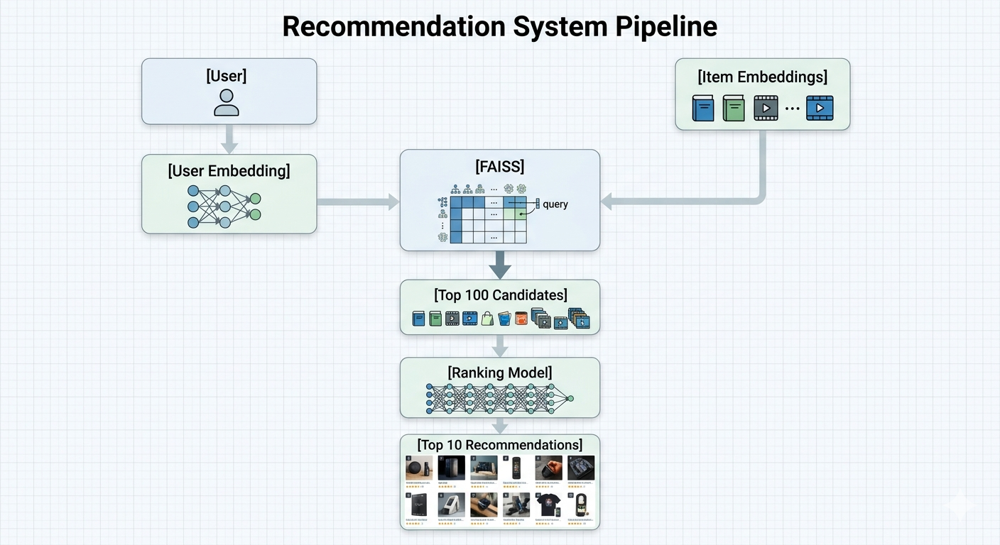

# End-to-End Recommendation System (Two-Tower + FAISS + Ranking)

This project implements a scalable and production-oriented recommendation system using a Two-Tower neural architecture, FAISS-based retrieval, and a neural ranking model.
## Project Overview

The goal of this project is to build a personalized recommendation system that suggests relevant items to users based on their interaction history.

The system is designed as a two-stage pipeline:
1. Candidate Generation (Two-Tower + FAISS)
2. Ranking Model (Neural Re-ranking)

## Model Architecture

- Two-Tower Neural Network (user and item embeddings)
- Item feature integration (genre features)
- FAISS for efficient nearest-neighbor retrieval
- Neural ranking model for re-ranking candidates

## Pipeline

### Offline Stage
- Data preprocessing
- Model training
- Item embedding generation
- FAISS index construction

### Online Stage
- User embedding computation
- FAISS candidate retrieval
- Seen item filtering
- Ranking model scoring
- Final recommendation generation

## Evaluation Metrics

- Recall@10: 0.1578
- FAISS Recall@10: 0.1411
- Precision@10: 0.2455
- Hit Rate@10: 0.8106
- Diversity: 0.6798

## Key Insights

- Significant improvement over baseline (0.049 → 0.157 Recall@10)
- Genre features improved generalization
- FAISS enabled scalable retrieval with minimal performance loss
- Ranking model improved recommendation precision
- The system maintains a balance between accuracy and diversity

## Example Recommendations

The system generates realistic and diverse recommendations, including:

- The Godfather  
- Trainspotting  
- Return of the Jedi  
- Air Force One

  ## Limitations

- Limited user-side features  
- No temporal modeling  
- Moderate popularity bias  
- No real-time learning

## Future Work

- Incorporate temporal dynamics  
- Add richer user features  
- Improve diversity-aware ranking  
- Introduce online learning and A/B testing

  ## Technologies Used

- Python  
- PyTorch  
- FAISS  
- Pandas / NumPy  
- Scikit-learn

  ## Author

This project was developed as an end-to-end machine learning system demonstrating recommendation system design, modeling, evaluation, and production-level architecture.
